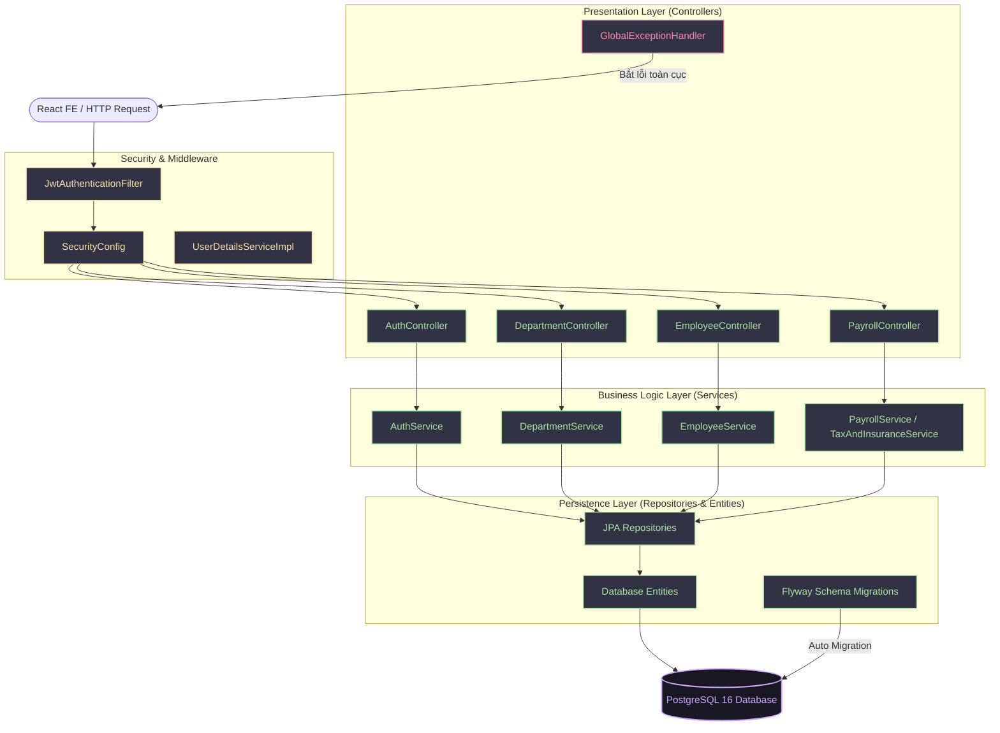
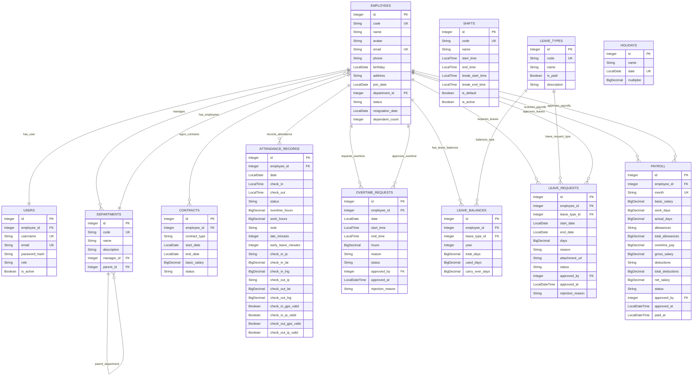
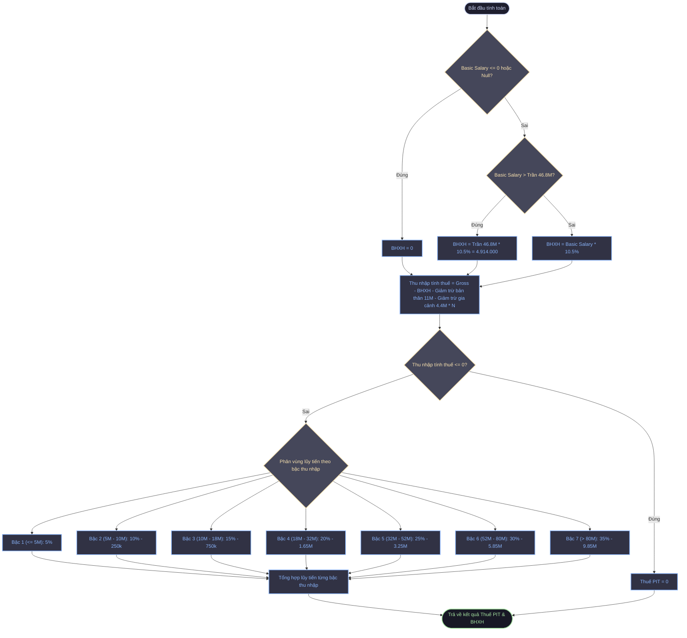
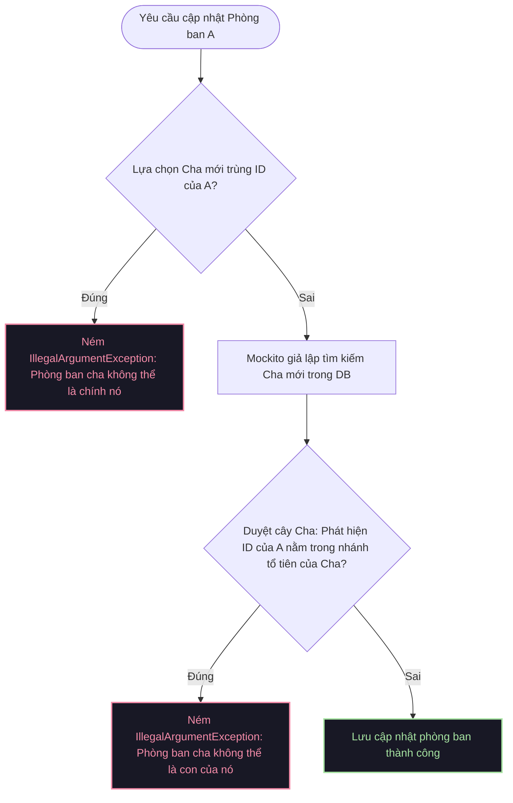
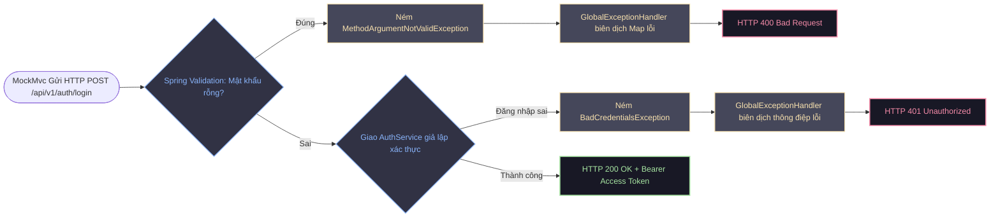

# 🍃 Spring Boot Backend - Human Resource Management (HRM) Engine

[](https://openjdk.org/)
[](https://spring.io/projects/spring-boot)
[](https://spring.io/projects/spring-security)
[](https://www.postgresql.org/)
[](https://flywaydb.org/)
[](https://swagger.io/)

Tài liệu kỹ thuật chuyên sâu dành riêng cho mã nguồn **Spring Boot Backend** (`HRM_backend`). Hệ thống cung cấp toàn bộ RESTful APIs phục vụ quản trị nhân sự, chấm công nâng cao (GPS/IP verification), cấu hình ca làm việc, tự động hóa đơn xin nghỉ phép và động cơ tính lương lũy tiến theo quy chuẩn luật lao động Việt Nam.

---

## 🏗️ Kiến trúc Hệ thống Backend (Clean Architecture Pattern)

Mã nguồn Backend tuân thủ nghiêm ngặt mô hình kiến trúc phân lớp (Layered Architecture) kết hợp với các nguyên lý thiết kế SOLID:



---

## 📊 Sơ đồ Quan hệ Thực thể Database (ER Diagram)

Dưới đây là thiết kế Schema cơ sở dữ liệu chi tiết của HRM được đồng bộ tự động thông qua **Flyway Migrations**:



---

## 🧪 Hệ thống Kiểm thử Toàn diện (Testing Architecture)

Mã nguồn backend áp dụng hai mô hình kiểm thử chính để bảo đảm tính an toàn tối đa cho dữ liệu doanh nghiệp và logic nghiệp vụ.

```
                    ┌───────────────────────────────┐
                    │       MÔ HÌNH KIỂM THỬ        │
                    └───────────────┬───────────────┘
                                    │
            ┌───────────────────────┴───────────────────────┐
            ▼                                               ▼
┌───────────────────────┐                       ┌───────────────────────┐
│   WHITE BOX TESTING   │                       │   BLACK BOX TESTING   │
│ (Unit & Mock Testing) │                       │  (Integration / API)  │
└───────────┬───────────┘                       └───────────┬───────────┘
            │                                               │
 ┌──────────┴──────────┐                         ┌──────────┴──────────┐
 ▼                     ▼                         ▼                     ▼
Thuật toán Thuế/BH     Tránh lặp phòng ban      MockMvc Standalone    Biên lỗi Validation
(Tax & Insurance)      (Cyclic Verification)    (API Endpoint Rules)  (400, 401, 200 states)
```

---

### 🔍 1. White Box Testing - Logic nội bộ & Thuật toán lõi

#### **Luồng Kiểm thử Thuật toán Thuế & BHXH bắt buộc Việt Nam (`TaxAndInsuranceServiceImplTest.java`)**

Nghiệp vụ tính toán bảo hiểm được quy định dựa trên mức lương cơ sở trần (Capped Basic Salary) và lũy tiến từng phần của Biểu thuế Thu nhập cá nhân (PIT) 7 bậc:



#### **Luồng Kiểm thử Chống lặp vòng cây Phòng ban (`DepartmentServiceImplTest.java`)**

Sử dụng Mockito để cô lập và kiểm chứng cấu trúc cây phân cấp phòng ban, chống đệ quy lặp vòng làm tràn bộ nhớ (Stack Overflow):



---

### 📥 2. Black Box Testing - Kiểm thử biên cổng API

Black Box Testing tập trung kiểm tra chất lượng của API đăng nhập `/api/v1/auth/login` thông qua MockMvc Standalone kết hợp đăng ký `GlobalExceptionHandler` để đảm bảo định dạng lỗi trả về thống nhất:



---

## ⚡ Các thông số & Kịch bản Test chi tiết (Test Specifications)

### **1. Phân vùng tương đương & Biên của Thuế & BHXH (White Box)**

Quy đổi: Mức lương cơ sở hiện hành của Việt Nam áp dụng trong hệ thống là **2.340.000 VND**.
*   **Trần BHXH bắt buộc:** 20 lần lương cơ sở = $20 \times 2.340.000 = 46.800.000\text{ VND}$.
*   **Mức đóng bảo hiểm xã hội bắt buộc:** 10.5% (8% BHXH, 1.5% BHYT, 1% BHTN).

| Mã Test | Mô tả Ca kiểm thử | Giá trị Đầu vào (Salary) | Phụ thuộc | Công thức Áp dụng | Đầu ra Kỳ vọng (Expected Output) |
| :--- | :--- | :--- | :--- | :--- | :--- |
| **WB-T-01** | Lương cơ bản Null | `null` | 0 | Không tính bảo hiểm | `0 VND` (Không lỗi hệ thống) |
| **WB-T-02** | Lương cơ bản âm | `-5,000,000 VND` | 0 | Giới hạn dưới | `0 VND` |
| **WB-T-03** | Lương dưới trần BHXH | `10,000,000 VND` | 0 | $10.000.000 \times 10.5\%$ | **`1,050,000 VND`** |
| **WB-T-04** | Lương chạm đúng trần | `46,800,000 VND` | 0 | $46.800.000 \times 10.5\%$ | **`4,914,000 VND`** |
| **WB-T-05** | Lương vượt trần BHXH | `60,000,000 VND` | 0 | Khống chế ở mức trần | **`4,914,000 VND`** (Capped) |
| **WB-T-06** | Thu nhập miễn thuế PIT | `10,000,000 VND` | 0 | Lương < Giảm trừ bản thân (11M)| **`0 VND`** |
| **WB-T-07** | Lương Chịu thuế Bậc 1 | Gross: `20,000,000 VND` | 1 | Chịu thuế: $20M - 11M(BT) - 4.4M(PT) - 2.1M(BH) = 2.5M \le 5M$ | **`125,000 VND`** ($2.5M \times 5\%$) |
| **WB-T-08** | Lương Chịu thuế Bậc 3 | Gross: `30,000,000 VND` | 0 | Chịu thuế: $30M - 11M - 3.15M = 15.85M$ (Bậc 3) | **`1,627,500 VND`** ($15.85M \times 15\% - 750k$) |
| **WB-T-09** | Lương Chịu thuế Bậc 7 | Gross: `120,000,000 VND` | 2 | Chịu thuế: $120M - 11M - 8.8M - 4.914M = 95.286M > 80M$ (Bậc 7) | **`23,500,100 VND`** ($95.286M \times 35\% - 9.85M$) |

---

### **2. Biên đầu vào & Phản hồi HTTP của API Login (Black Box)**

| Mã Test | Mô tả Kiểm thử | Payload REST Gửi đi | HTTP Code | Cấu trúc JSON Phản hồi (Expected Response) |
| :--- | :--- | :--- | :--- | :--- |
| **BB-T-01** | Thông tin đăng nhập hợp lệ | `{"username": "admin", "password": "password123"}` | **200 OK** | `{"success": true, "message": "Đăng nhập thành công", "data": {"accessToken": "mock-jwt...", "role": "ADMIN"}}` |
| **BB-T-02** | Mật khẩu để trống (Biên Validation) | `{"username": "admin", "password": ""}` | **400 Bad Request** | `{"success": false, "message": "Dữ liệu đầu vào không hợp lệ", "data": {"password": "Mật khẩu không được để trống"}}` |
| **BB-T-03** | Sai mật khẩu (Bad Credentials) | `{"username": "admin", "password": "wrong_password"}` | **401 Unauthorized**| `{"success": false, "message": "Tên đăng nhập hoặc mật khẩu không đúng"}` |

---

## 🛠️ Hướng dẫn Setup & Khởi chạy Backend

### **1. Biến môi trường cấu hình (Environment Variables)**

Backend có thể cấu hình linh hoạt qua tệp [application.yml](file:///c:/Users/Lenovo/Desktop/HRM/HRM_backend/src/main/resources/application.yml) hoặc thiết lập các biến môi trường trực tiếp trên OS hoặc Docker:

```properties
DB_HOST=localhost         # Host kết nối PostgreSQL database
DB_PORT=5432              # Cổng kết nối PostgreSQL
DB_NAME=HRM               # Tên Database tạo sẵn
DB_USERNAME=postgres      # Tài khoản Database
DB_PASSWORD=123456        # Mật khẩu Database
SMTP_USERNAME=your_gmail  # Tài khoản SMTP gửi mail
SMTP_PASSWORD=your_app_pw # Mật khẩu ứng dụng SMTP Gmail
```

### **2. Chạy thủ công trên máy thật**

Yêu cầu máy cài đặt **Java 21** và **Maven 3.9+**.

1. Cài đặt thư viện và biên dịch mã nguồn:
   ```bash
   mvn clean install
   ```
2. Khởi động ứng dụng Spring Boot Backend:
   ```bash
   mvn spring-boot:run
   ```
3. Truy cập tài liệu mô tả RESTful APIs thông qua Swagger UI:
   [http://localhost:8080/swagger-ui/index.html](http://localhost:8080/swagger-ui/index.html)

---

### **3. Thực thi Bộ Kiểm thử tự động (Running Tests)**

Thực thi kịch bản kiểm thử toàn diện (White Box & Black Box) để đảm bảo chất lượng vận hành:
```bash
mvn test
```

Màn hình hiển thị kết quả kiểm thử hoàn thành thành công:
```text
[INFO] -------------------------------------------------------
[INFO]  T E S T S
[INFO] -------------------------------------------------------
[INFO] Running com.hrm.backend.service.impl.TaxAndInsuranceServiceImplTest
[INFO] Tests run: 9, Failures: 0, Errors: 0, Skipped: 0, Time elapsed: 0.112 s
[INFO] Running com.hrm.backend.service.impl.DepartmentServiceImplTest
[INFO] Tests run: 7, Failures: 0, Errors: 0, Skipped: 0, Time elapsed: 0.720 s
[INFO] Running com.hrm.backend.controller.AuthControllerBlackBoxTest
[INFO] Tests run: 3, Failures: 0, Errors: 0, Skipped: 0, Time elapsed: 1.050 s
[INFO] 
[INFO] Results:
[INFO] 
[INFO] Tests run: 19, Failures: 0, Errors: 0, Skipped: 0
[INFO] 
[INFO] ------------------------------------------------------------------------
[INFO] BUILD SUCCESS
[INFO] ------------------------------------------------------------------------
```

---
**Lead Backend Architect** - *Tran Si Cuong (TranSiCuongcn1)*
