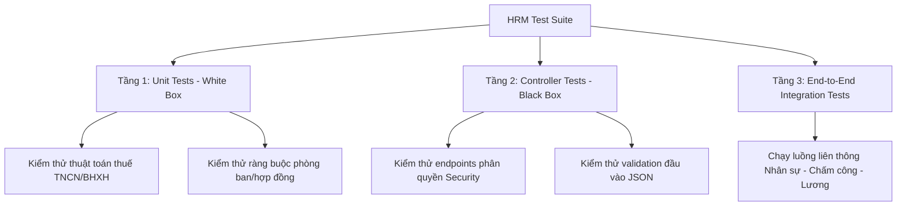

# Hướng Dẫn Kiểm Thử Hệ Thống Quản Lý Nhân Sự (HRM Testing Guide)

Tài liệu này cung cấp cái nhìn toàn diện về cấu trúc kiểm thử (Testing Architecture), phân loại kiểm thử, cách thức vận hành và cơ chế tự động kết xuất báo cáo trong phân hệ Spring Boot Backend của dự án HRM.

---

## Kiến Trúc Kiểm Thử (Testing Architecture)

Hệ thống kiểm thử backend được chia thành 3 tầng chính để đảm bảo tính ổn định, tin cậy và hiệu năng vận hành cao nhất.



### 1. Tầng 1: Kiểm Thử Đơn Thể (Unit Tests - White Box)
* **Khái niệm:** Áp dụng phương pháp **Kiểm thử hộp trắng (White-box Testing)**. Chúng ta biết rõ cấu trúc mã nguồn bên trong và kiểm tra tính chính xác của các thuật toán xử lý logic nghiệp vụ chi tiết.
* **Vị trí thư mục:** `src/test/java/com/hrm/backend/service/impl/`
* **Mô tả:** Sử dụng Mockito để cô lập các Service khỏi tầng Database JPA và kiểm thử các nghiệp vụ lõi:
  - Thuật toán tính thuế TNCN lũy tiến từng bậc và bảo hiểm xã hội bắt buộc (`TaxAndInsuranceServiceImplTest`).
  - Logic tính ngày công đi muộn/về sớm đối chiếu theo ca làm việc (`AttendanceServiceImplTest`).
  - Ràng buộc hợp đồng lao động theo luật Việt Nam (`ContractServiceImplTest`).
  - Cấu trúc phòng ban và đệ quy phòng ban cha-con (`DepartmentServiceImplTest`).

### 2. Tầng 2: Kiểm Thử Biên API (Controller Tests - Black Box)
* **Khái niệm:** Áp dụng phương pháp **Kiểm thử hộp đen (Black-box Testing)**. Chúng ta coi các Controller là một "chiếc hộp đen" đóng kín. Chúng ta không quan tâm code xử lý thế nào, chỉ quan tâm: *"Nếu Client gửi một HTTP Request (JSON) đến Endpoint này, thì HTTP Response nhận về (Status code, Body) có chính xác hay không?"*
* **Vị trí thư mục:** `src/test/java/com/hrm/backend/controller/`
* **Cách đặt tên:** Các file kiểm thử tầng này luôn có hậu tố `BlackBoxTest` (Ví dụ: `ShiftControllerBlackBoxTest`, `PayrollControllerBlackBoxTest`) để phân biệt rạch ròi với tầng Unit Test.
* **Mô tả:** Sử dụng `MockMvc` độc lập phối hợp với cơ chế Security Test để xác thực:
  - Kiểm tra xem API có chặn người dùng không có quyền (ví dụ Employee gọi API của Admin) -> trả về `403 Forbidden`.
  - Kiểm tra validation đầu vào (ví dụ email sai định dạng, thiếu trường bắt buộc) -> trả về `400 Bad Request`.
  - Các kịch bản gọi API thành công trả về đúng `200 OK` hoặc `201 Created`.

### 3. Tầng 3: Kiểm Thử Tích Hợp Toàn Diện (End-to-End Integration Tests)
* **Khái niệm:** Chạy toàn bộ hệ thống từ Controller xuống Service và ghi xuống Database test (H2 Database) để kiểm tra luồng liên thông.
* **Vị trí thư mục:** `src/test/java/com/hrm/backend/integration/`
* **Lớp kiểm thử:** `HrmEndToEndIntegrationTest.java`
* **Mô tả:** Chạy một quy trình thực tế từ Đăng nhập ➔ Tạo nhân viên ➔ Ký hợp đồng ➔ Thiết lập ca làm việc ➔ Chấm công đi làm ➔ Xin nghỉ phép/Overtime ➔ Tính lương tháng và kết xuất bảng lương.

---

## Cách Thức Chạy Kiểm Thử (Execution Instructions)

Bạn có thể kích hoạt toàn bộ 192 test cases bằng các cách sau:

### 1. Sử dụng Terminal (Command Line Interface)
Di chuyển vào thư mục `HRM_backend` và chạy lệnh:
```powershell
.\mvnw.cmd test
```

### 2. Sử dụng IDE (IntelliJ IDEA / VS Code)
- Để chạy toàn bộ: Click chuột phải vào thư mục `src/test/java` và chọn **Run 'All Tests'**.
- Để chạy lẻ: Click vào biểu tượng mũi tên xanh bên cạnh tên Class hoặc Method test cụ thể và chọn **Run**.

---

## Báo Cáo & Kết Quả Kiểm Thử Tự Động (Automated Test Results)

Chúng ta đã tích hợp thành công bộ thu thập dữ liệu kiểm thử **UnitTestReportListener** thông qua cơ chế Java SPI (`META-INF/services`). 

### Kết quả đầu ra:
1. **Bảng ASCII trên Terminal:** Ngay sau khi chạy lệnh test hoàn tất, một bảng ASCII màu sắc ANSI trực quan sẽ hiển thị toàn bộ trạng thái chi tiết của 192 test cases giúp bạn quan sát cực kỳ nhanh chóng.
2. **Tệp Kết Quả Kiểm Thử Markdown Chuyên Nghiệp:** Kết quả chính thức dạng bảng Markdown (hoàn toàn không chứa icon/emoji, chuẩn hóa báo cáo doanh nghiệp) sẽ tự động được ghi đè tại:
   - [TEST_RESULT.md](TEST_RESULT.md) (Nằm ngay cùng thư mục `docs/test-reports/` này).
   - [target/TEST_RESULT.md](../../target/TEST_RESULT.md) (Nằm trong thư mục target của build để lưu trữ).
